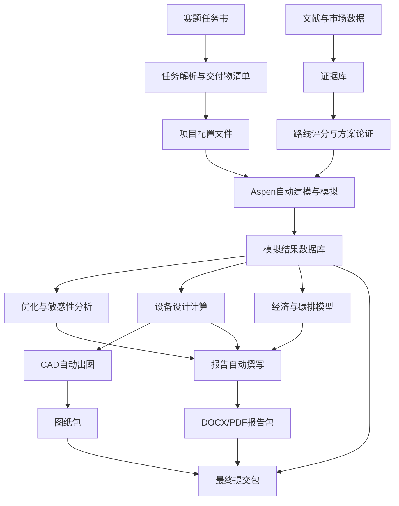

# 2026 天正设计杯苯乙烯清洁生产分厂全自动推进实施方案

版本：v1.0  
日期：2026-04-28  
适用项目：第二十届全国大学生化工设计竞赛，苯乙烯清洁生产分厂设计  
工作目录：`E:\工作区\aspen-python-automation`

---

## 1. 文档目的

本文档用于把本届化工设计竞赛从“赛题理解”推进到“可提交作品包”的全过程拆解为可执行、可验收、可定期调整的自动化工程。

本文档不是最终设计说明书，而是比赛项目的总控实施方案。它回答以下问题：

1. 比赛需要交付什么。
2. 每个交付物由哪些数据、模型、图纸和文字自动生成。
3. 文献查找、路线选取、Aspen模拟、CAD出图、文档撰写如何串成闭环。
4. 每一阶段如何验收，失败时如何回滚或调整。
5. 每周如何复盘进度、风险和质量。

总原则：机器负责高频、重复、可追踪的工作；人负责工程判断、路线拍板、安全伦理和最终签字。

---

## 2. 任务书摘要与硬性要求

### 2.1 设计题目

为某大型化工企业设计一座苯乙烯清洁生产分厂，技术需符合中国绿色低碳循环发展要求。

### 2.2 设计基础条件

任务书将以下关键边界交给参赛队自主确定：

| 项目 | 任务书要求 | 本项目处理方式 |
|---|---|---|
| 原料 | 原料类型及规格由参赛队根据资源调研自行确定 | 通过文献、市场、园区资源自动调研形成候选方案 |
| 产品 | 产品结构及技术规格由参赛队根据市场规划自行拟订 | 以聚合级苯乙烯为主产品，副产品按路线自动识别 |
| 生产规模 | 根据资源规划、市场规划和政策自行确定 | 设置多个规模场景，自动完成经济性和敏感性比较 |
| 安全 | 安全第一，提高本质安全性，采用新的安全技术和安全设计方法 | 设置HAZOP、LOPA、泄放、联锁、SIS建议清单 |
| 节能环保 | 优先采用低物耗、低能耗、低排放工艺 | 将单位能耗、碳排、废水废气作为优化目标 |
| 公用工程 | 与总厂公用工程系统集成 | 设计蒸汽、冷却水、电、氮气、仪表空气等接口模型 |

### 2.3 必须提交材料

| 编号 | 必交材料 | 格式要求 | 自动化目标 |
|---|---|---|---|
| A1 | 项目可行性研究报告 | DOCX + PDF，4万字以内 | 自动生成初稿、图表、参考文献、指标表 |
| A2 | 初步设计说明书 | DOCX + PDF，15万字以内 | 自动生成章节、物热衡算、设备表、经济评价 |
| A3 | 典型设备工艺设计计算说明书 | DOCX + PDF，5万字以内 | 反应器、塔器、换热器自动计算和成文 |
| A4 | 设计图集 | AutoCAD 2004兼容格式 + PDF | 自动生成PFD、P&ID、平立面、总图、设备条件图 |
| A5 | 工艺流程模拟及优化结果和源程序 | Aspen文件、结果表、Python脚本 | 一键重跑模拟、优化、导出结果 |

缺少任一基本材料将不能取得成功参赛资格，因此所有必交材料均设置为一级交付物。

### 2.4 计分增强材料

| 编号 | 加分材料 | 自动化目标 |
|---|---|---|
| B1 | HAZOP分析文档及源文件 | 自动生成节点划分、偏差表、原因、后果、保护层、建议措施 |
| B2 | 能量集成与节能技术结果及源文件 | 自动提取冷热物流，生成夹点分析、换热网络建议 |
| B3 | 过程成本估算和经济评价源文件 | 自动生成CAPEX、OPEX、TAC、NPV、IRR、敏感性分析 |
| B4 | 容器类设备结构设计源文件 | 输出设备工艺条件，衔接外部强度计算软件 |
| B5 | 三维设计源文件 | 输出设备坐标、管口、基础数据，服务三维布置 |

### 2.5 格式约束

1. 说明书保存为DOCX和PDF。
2. 图纸保存为AutoCAD 2004版兼容格式和PDF。
3. 图纸文字样式使用国标汉字大字体 `gbcbig.shx`。
4. 所有专业软件完成的内容必须提供相应源文件。
5. 所有模拟、计算结果必须可在队伍便携计算机上正常运行并可现场验证。

---

## 3. 项目成功标准

### 3.1 最低成功标准

达到以下条件即满足成功参赛底线：

1. 可研报告、初设说明书、设备计算书均完成DOCX和PDF。
2. PFD、P&ID、车间平面图、车间立面图、总平面图、主要设备条件图均完成DWG/DXF和PDF。
3. Aspen模型可打开，主流程可收敛，能导出完整物料衡算和热量衡算。
4. 至少完成反应器、精馏塔、换热器三类典型设备计算。
5. 有完整设备一览表、物流表、公用工程消耗表、经济评价表。
6. 所有引用文献可追溯，正文中的关键工程数据有来源或计算依据。

### 3.2 竞争性成功标准

达到以下条件可显著提升作品竞争力：

1. 工艺路线选择有系统评分，不是只凭主观描述。
2. Aspen模拟不仅收敛，而且完成多目标优化。
3. 对单位产品能耗、碳排、TAC、产品纯度、收率建立统一指标体系。
4. 有能量集成方案，包括夹点分析和余热回收。
5. 有HAZOP分析和本质安全设计闭环。
6. 报告、图纸、模拟、设备计算的数据一致，能通过现场抽查。
7. 现场可以演示一键重跑：读取配置、运行Aspen、更新表格、更新报告部分章节。

### 3.3 自动化成功标准

自动化系统本身按以下标准验收：

1. 任一核心数据只维护一次，后续文档、图纸和表格自动引用。
2. 修改生产规模、产品规格或关键操作条件后，可自动刷新主要结果。
3. 所有中间文件有时间戳、版本号和来源记录。
4. 失败的Aspen样本不会中断全流程，而是进入失败队列并生成诊断。
5. 每周可自动生成项目周报，包括完成率、风险、缺口和下周计划。

---

## 4. 总体技术路线

### 4.1 推荐主路线

推荐以“苯 + 乙烯制乙苯，乙苯脱氢制苯乙烯”为主路线，并允许在方案论证阶段比较“外购乙苯直接脱氢”和“CO2辅助乙苯脱氢”等路线。

推荐原因：

1. 工业成熟度高，工程可信度强。
2. 文献和设计数据丰富，便于写可研、设备和经济章节。
3. Aspen可模拟性强，适合自动化优化。
4. 主反应、副反应、精制分离、公用工程、能量集成均有充分设计空间。
5. 可在传统路线基础上加入低碳创新点，避免为追求新颖而失去工程可落地性。

### 4.2 候选路线库

| 路线编号 | 路线名称 | 核心流程 | 优点 | 风险 | 建议用途 |
|---|---|---|---|---|---|
| R1 | 外购乙苯脱氢制苯乙烯 | 乙苯脱氢、冷凝分离、苯乙烯精制、乙苯回收 | 模型简单，适合快速形成完整作品 | 原料规划论证略弱 | 保底路线 |
| R2 | 苯-乙烯烷基化制乙苯 + 脱氢 | 苯烷基化、乙苯精制、乙苯脱氢、苯乙烯精制 | 完整产业链，适合大型企业分厂设定 | 流程更长，设备更多 | 推荐主路线 |
| R3 | CO2辅助乙苯脱氢 | CO2作为温和氧化剂参与脱氢 | 低碳叙事强，创新性较高 | 工业成熟度、动力学数据和催化剂论证难 | 作为创新对比或局部增强 |
| R4 | 氧化脱氢制苯乙烯 | O2或其他氧化体系 | 理论能耗低 | 安全和选择性风险高 | 仅作为文献对比 |
| R5 | 生物乙醇经乙烯路线间接制苯乙烯 | 生物乙醇脱水制乙烯，再制乙苯和苯乙烯 | 非化石资源亮点 | 碳足迹边界复杂，流程过长 | 可作为原料低碳补充方案 |

### 4.3 推荐主流程边界

第一版Aspen主流程建议包括：

1. 原料预处理与混合。
2. 苯与乙烯烷基化生成乙苯，可在初版中简化为乙苯进料。
3. 乙苯脱氢反应器。
4. 反应气冷却与气液分离。
5. 氢气及轻组分处理。
6. 苯、甲苯、乙苯、苯乙烯分离。
7. 乙苯循环。
8. 苯乙烯产品精制。
9. 废液、废气和副产物处理。
10. 公用工程和热集成。

分阶段策略：

| 阶段 | Aspen范围 | 目标 |
|---|---|---|
| M0 | 乙苯脱氢 + 简化分离 | 快速收敛，形成物热衡算骨架 |
| M1 | 完整脱氢与精制 | 获取产品纯度、收率、能耗 |
| M2 | 加入烷基化制乙苯 | 完整主路线论证 |
| M3 | 加入热集成和优化 | 形成竞争性方案 |
| M4 | 加入环境和经济模型 | 支撑报告与答辩 |

---

## 5. 自动化系统总体架构

### 5.1 数据流总览



### 5.2 模块划分

| 模块 | 名称 | 输入 | 输出 | 验收标准 |
|---|---|---|---|---|
| S0 | 赛题解析模块 | 任务书PDF | 交付物矩阵、格式约束、价格常数 | 覆盖任务书所有条款 |
| S1 | 文献检索模块 | 关键词、路线候选 | 文献库、DOI表、摘要表、证据摘录 | 每个关键论点至少2个来源 |
| S2 | 路线选取模块 | 文献库、市场数据、约束 | 路线评分表、推荐路线、备选路线 | 推荐路线理由可量化 |
| S3 | Aspen自动模拟模块 | 流程配置、反应参数、设备参数 | Aspen文件、物热衡算、收敛日志 | 主流程可重复收敛 |
| S4 | 优化模块 | Aspen接口、目标函数、变量边界 | Pareto解、敏感性图、最优工况 | 指标完整且可复算 |
| S5 | 设备计算模块 | 物流表、物性、设计准则 | 设备尺寸、设备表、计算书 | 与模拟数据一致 |
| S6 | 经济与碳排模块 | 设备表、公用工程、价格参数 | CAPEX、OPEX、TAC、NPV、碳排 | 价格来源可追溯 |
| S7 | HAZOP模块 | PFD/P&ID节点、物料性质 | HAZOP表、整改措施 | 覆盖关键节点 |
| S8 | CAD出图模块 | 设备坐标、流程拓扑、仪表清单 | DWG/DXF/PDF图纸 | 满足AutoCAD 2004和字体要求 |
| S9 | 文档生成模块 | 所有结果数据库 | DOCX/PDF说明书和报告 | 图表编号、引用、数据一致 |
| S10 | 总提交包模块 | 报告、图纸、源文件 | 可提交压缩包、现场验证清单 | 可在便携电脑上打开运行 |

### 5.3 推荐目录结构

```text
aspen-python-automation/
  config/
    project.yml
    routes.yml
    economics.yml
    report_outline.yml
  data/
    task/
      contest_task.pdf
      task_requirements.yml
    literature/
      references.bib
      evidence_table.xlsx
      papers/
    market/
      raw_material_prices.xlsx
      product_prices.xlsx
      policy_notes.md
    properties/
      components.yml
      safety_properties.yml
  models/
    aspen/
      baseline/
      optimized/
    cad/
      templates/
      generated/
    three_d/
  results/
    simulation/
    optimization/
    equipment/
    economics/
    hazop/
    energy_integration/
  outputs/
    reports/
      feasibility/
      preliminary_design/
      equipment_calculation/
      hazop/
    drawings/
      pfd/
      pid/
      layout/
      equipment_condition/
    submission_package/
  src/
    competition_pipeline/
      task_parser/
      literature/
      route_selection/
      aspen_runner/
      optimizer/
      equipment_design/
      economics/
      hazop/
      cad_generator/
      report_generator/
      packaging/
  docs/
    competition/
    weekly_reviews/
```

---

## 6. 核心配置与数据治理

### 6.1 单一事实源

所有关键参数进入统一配置文件，禁止在报告、脚本、CAD图纸中手工重复维护。

第一批核心参数：

| 参数类别 | 示例 | 来源 |
|---|---|---|
| 产品规格 | 苯乙烯质量分数、水分、聚合物级指标 | 文献、国标、企业公开资料 |
| 生产规模 | 年产量、开工时数、操作弹性 | 市场规划与资源规划 |
| 原料规格 | 苯、乙烯、乙苯纯度和杂质 | 供应链调研 |
| 反应条件 | 温度、压力、蒸汽/乙苯比、转化率、选择性 | 文献与Aspen校准 |
| 分离指标 | 塔顶塔底组成、回流比、理论板数 | Aspen结果 |
| 公用工程 | 蒸汽、电、冷却水、软水、污水处理 | 任务书和市场调研 |
| 经济价格 | 设备材料价格、公用工程价格、人工成本 | 任务书和市场调研 |
| 碳排因子 | 电、蒸汽、燃料、原料 | 政策和数据库调研 |

### 6.2 任务书经济参数

任务书给出的价格数据必须固化为默认经济参数：

| 项目 | 价格 |
|---|---:|
| 304不锈钢设备 | 48000 元/吨 |
| 中低压碳钢设备，不高于4MPa | 18000 元/吨 |
| 高压碳钢设备 | 22000 元/吨 |
| 低压蒸汽，1.8MPa | 255 元/吨 |
| 中压蒸汽，3.8MPa | 265 元/吨 |
| 高压蒸汽，9.8MPa | 285 元/吨 |
| 电 | 0.70 元/kWh |
| 工艺软水 | 10 元/吨 |
| 冷却水 | 0.5 元/吨 |
| 污水处理费，COD小于500 | 5 元/吨 |
| 人工平均成本 | 12000 元/月/人 |
| 技术来源 | 按知识产权费用估算 |

### 6.3 数据版本规则

所有自动化结果必须包含：

1. `run_id`：唯一运行编号。
2. `config_hash`：配置文件哈希。
3. `source_file`：来源文件。
4. `generated_at`：生成时间。
5. `operator`：运行人或自动任务名。
6. `status`：成功、失败、人工确认、废弃。

### 6.4 数据一致性规则

1. 报告中的物料衡算表只能来自Aspen导出结果。
2. 设备计算书中的物流条件只能来自已冻结模拟版本。
3. CAD图中的设备编号只能来自设备一览表。
4. 经济评价中的设备数量只能来自设备一览表。
5. HAZOP节点只能来自PFD/P&ID的流程节点。
6. 修改核心参数后，必须重新生成受影响表格并标记旧版本作废。

---

## 7. 文献查找自动化方案

### 7.1 文献检索目标

文献检索不是为了堆引用，而是为了支撑以下工程判断：

1. 为什么选择该工艺路线。
2. 原料、产品和规模为何合理。
3. 反应条件、转化率、选择性、催化剂参数从何而来。
4. 分离流程和精制指标是否符合工业经验。
5. 节能、低碳和废物资源化方案是否有依据。
6. 安全风险、HAZOP节点和保护措施是否有依据。
7. 经济价格、设备估算和碳排因子是否可追溯。

### 7.2 检索渠道

| 渠道 | 用途 | 自动化方式 |
|---|---|---|
| CNKI | 中文工程设计、行业综述、竞赛作品参考 | 关键词检索、结果解析、题录导出 |
| Google Scholar | 国际综述和高被引文献 | 关键词检索、引用链追踪 |
| Crossref | DOI、出版信息、BibTeX | API补全元数据 |
| ScienceDirect/ACS/RSC/Springer | 反应、催化、分离、低碳工艺 | DOI和PDF下载或记录访问路径 |
| 专利数据库 | 工艺包、催化剂、流程创新 | 关键词和申请人检索 |
| 政策/行业报告 | 市场规模、价格、碳政策 | 人工确认后入库 |
| Zotero | 统一文献管理 | 自动导入、分组、标签、笔记 |

### 7.3 关键词体系

| 主题 | 中文关键词 | 英文关键词 |
|---|---|---|
| 主路线 | 苯乙烯 乙苯 脱氢 工艺 | styrene ethylbenzene dehydrogenation process |
| 催化剂 | 乙苯脱氢 催化剂 铁钾 铬-free | ethylbenzene dehydrogenation catalyst iron potassium |
| 低碳路线 | CO2辅助 乙苯脱氢 二氧化碳 | CO2-assisted ethylbenzene dehydrogenation |
| 氧化脱氢 | 乙苯 氧化脱氢 苯乙烯 | oxidative dehydrogenation ethylbenzene styrene |
| 分离精制 | 苯乙烯 精馏 阻聚 回收 | styrene distillation polymerization inhibitor separation |
| 热集成 | 苯乙烯装置 余热回收 夹点分析 | styrene plant heat integration pinch analysis |
| 安全 | 苯乙烯 HAZOP 聚合 爆炸 | styrene HAZOP polymerization runaway safety |
| 环保 | 苯乙烯 废气 废水 VOC | styrene VOC wastewater emission control |
| 经济 | 苯乙烯 成本 经济评价 | styrene techno-economic analysis |
| 碳排 | 苯乙烯 碳足迹 生命周期 | styrene carbon footprint life cycle assessment |

### 7.4 文献分类标签

每篇文献导入后必须打标签：

1. `route_selection`
2. `reaction_kinetics`
3. `catalyst`
4. `separation`
5. `energy_integration`
6. `safety_hazop`
7. `environment`
8. `economics`
9. `market_policy`
10. `equipment_design`
11. `aspen_modeling`
12. `citation_candidate`

### 7.5 文献证据表字段

| 字段 | 说明 |
|---|---|
| evidence_id | 证据编号 |
| claim | 支撑的结论 |
| source_type | 期刊、专利、标准、报告、教材 |
| title | 题名 |
| authors | 作者 |
| year | 年份 |
| doi_or_url | DOI或链接 |
| key_data | 关键数据 |
| applicability | 与本设计的适用性 |
| limitation | 局限性 |
| confidence | 高、中、低 |
| used_in | 报告章节 |

### 7.6 文献阶段验收

| 阶段 | 验收项 | 合格标准 |
|---|---|---|
| L1 | 路线文献池 | 至少30篇路线相关文献，含中英文 |
| L2 | 反应和催化文献池 | 至少15篇，能支撑反应条件和转化选择性 |
| L3 | 分离和阻聚文献池 | 至少10篇，能支撑精制和安全 |
| L4 | 低碳和热集成文献池 | 至少10篇，能支撑节能方案 |
| L5 | 经济和市场文献池 | 至少10条，含价格或市场依据 |
| L6 | 可引用证据表 | 每个核心结论至少2条证据 |

---

## 8. 工艺路线选取方案

### 8.1 路线评价指标

采用加权评分，初始权重如下：

| 指标 | 权重 | 评分说明 |
|---|---:|---|
| 技术成熟度 | 15% | 工业应用越成熟分越高 |
| 原料可获得性 | 10% | 原料供应、价格、园区协同越好分越高 |
| 产品竞争力 | 8% | 产品规格、市场容量、利润空间 |
| 单位能耗 | 12% | 单位产品蒸汽、电、燃料越低分越高 |
| 碳排表现 | 12% | 直接和间接碳排越低分越高 |
| 收率和选择性 | 10% | 乙苯转化、苯乙烯选择性、循环效率 |
| 安全风险 | 10% | 高温、高压、氧化、聚合风险越低分越高 |
| 环保压力 | 8% | VOC、废水、副产物处理难度 |
| Aspen可模拟性 | 8% | 组分、物性、反应、收敛可行性 |
| 设计完整度 | 7% | 是否利于设备、图纸、经济、答辩完整展开 |

### 8.2 路线筛选流程

1. 自动生成候选路线列表。
2. 自动检索每条路线的文献和专利。
3. 提取关键数据：转化率、选择性、温度、压力、能耗、催化剂、工业化程度。
4. 自动填充评分矩阵。
5. 对证据不足的评分标记为低置信度。
6. 生成人工审查版路线选择报告。
7. 队伍开会冻结主路线和备选路线。
8. 路线冻结后进入Aspen建模。

### 8.3 路线阶段验收

| 验收项 | 合格标准 |
|---|---|
| 候选路线完整性 | 至少比较3条路线 |
| 评分矩阵完整性 | 所有指标均有分数和证据 |
| 推荐路线明确 | 给出主路线、备选路线、淘汰路线 |
| 低碳逻辑清晰 | 明确节能、降耗、减排路径 |
| 与任务书一致 | 能回应绿色低碳循环发展要求 |

---

## 9. Aspen全自动模拟方案

### 9.1 Aspen自动化目标

1. 自动打开或生成Aspen模型。
2. 自动写入组分、物性方法、操作条件、设计规格。
3. 自动运行模拟。
4. 自动提取物流表、能量表、设备负荷、塔参数。
5. 自动记录收敛状态和失败原因。
6. 自动输出CSV、JSON、Excel和报告用表格。

### 9.2 物性方法建议

初始建议：

| 系统 | 推荐物性方法 | 说明 |
|---|---|---|
| 芳烃、乙苯、苯乙烯、轻烃 | Peng-Robinson 或 SRK | 烃类体系常用，先用于主模型 |
| 非理想液相分离 | NRTL 或 UNIQUAC | 精制段如出现非理想问题时评估 |
| 含水蒸汽脱氢体系 | PR-BM 或 RK-SOAVE | 结合Aspen数据库和收敛表现选择 |

物性方法最终必须通过文献和模拟表现共同确认。

### 9.3 第一版组分清单

| 组分 | 用途 |
|---|---|
| BENZENE | 烷基化原料、循环组分 |
| ETHYLENE | 烷基化原料 |
| ETHYLBENZENE | 脱氢原料 |
| STYRENE | 主产品 |
| HYDROGEN | 脱氢副产轻组分 |
| TOLUENE | 副产物 |
| BENZENE副产/回收 | 副产和循环 |
| WATER | 蒸汽稀释、冷凝分离 |
| METHANE/ETHANE | 轻组分代表 |
| DIETHYLBENZENE | 烷基化副产物，可在M2加入 |

### 9.4 反应建模策略

分三层推进：

| 层级 | 建模方式 | 用途 |
|---|---|---|
| R0 | RStoic，指定转化率和选择性 | 快速跑通全流程 |
| R1 | REquil 或 RGibbs | 检查热力学上限和趋势 |
| R2 | RPlug 或 RCSTR，输入动力学 | 形成高质量设计和优化依据 |

第一阶段优先采用RStoic或简化动力学，确保流程完整；第二阶段再逐步替换为动力学模型。

### 9.5 主模型流程节点

| 节点 | Aspen模块 | 设计目标 |
|---|---|---|
| 原料混合 | MIXER | 乙苯、水蒸汽、循环物流混合 |
| 预热 | HEATER/HEATX | 达到反应入口温度 |
| 脱氢反应 | RSTOIC/RPLUG | 乙苯转化为苯乙烯和氢气 |
| 急冷 | COOLER/FLASH | 抑制聚合，完成初步气液分离 |
| 轻组分分离 | FLASH/SEP | 分离氢气和轻烃 |
| 苯/甲苯回收 | RADFRAC | 分离轻芳烃 |
| 乙苯回收 | RADFRAC | 未反应乙苯循环 |
| 苯乙烯精制 | RADFRAC | 达到产品规格 |
| 热集成 | HEATX | 回收高温物流热量 |

### 9.6 关键设计变量

| 变量 | 初始范围 | 影响指标 |
|---|---|---|
| 脱氢温度 | 560-650 C | 转化率、选择性、能耗、结焦风险 |
| 反应压力 | 0.1-0.3 MPa | 平衡转化率、压缩成本 |
| 蒸汽/乙苯摩尔比 | 6-12 | 平衡、结焦、蒸汽消耗 |
| 单程转化率 | 35%-70% | 循环量、分离负荷 |
| 苯乙烯选择性 | 85%-95% | 收率、副产物 |
| 精馏塔回流比 | 1.1-2.5倍最小回流比 | 能耗、塔径、纯度 |
| 塔板数 | 根据设计规格自动搜索 | 投资和能耗 |
| 乙苯循环比 | 自动计算 | 总收率和能耗 |

### 9.7 输出数据

每次模拟输出：

1. `stream_table.csv`：物流表。
2. `energy_table.csv`：能量表。
3. `block_table.csv`：单元设备结果。
4. `utility_table.csv`：公用工程表。
5. `composition_table.csv`：关键组分组成。
6. `convergence_log.json`：收敛日志。
7. `model_snapshot.bkp`：Aspen备份文件。
8. `model_contract.json`：模型输入输出契约。

### 9.8 Aspen阶段验收

| 阶段 | 验收标准 |
|---|---|
| A0 | 可自动启动Aspen并打开基准模型 |
| A1 | 简化乙苯脱氢模型收敛 |
| A2 | 完整分离流程收敛，产品纯度达到设定目标 |
| A3 | 自动导出物料和热量衡算 |
| A4 | 100组样本批量运行，成功率不低于80% |
| A5 | 优化后方案比基准方案在能耗或TAC上有可证明改进 |
| A6 | 模型、脚本和结果能在便携电脑上重跑 |

---

## 10. 优化与敏感性分析方案

### 10.1 优化目标

建议采用多目标优化：

| 目标 | 方向 | 说明 |
|---|---|---|
| 苯乙烯产品纯度 | 最大化或约束 | 必须达到产品规格 |
| 总收率 | 最大化 | 反映原料利用效率 |
| 单位产品能耗 | 最小化 | 蒸汽、电、冷却负荷折算 |
| TAC | 最小化 | 年总成本 |
| 单位产品碳排 | 最小化 | 间接和直接排放 |
| 废物流量 | 最小化 | 废水、废气、副产物 |

### 10.2 约束条件

1. 产品纯度达到设定规格。
2. 苯乙烯塔底温度不得引发过高聚合风险。
3. 设备操作压力和温度在材料允许范围内。
4. 精馏塔不出现液泛或不可行塔径。
5. 公用工程负荷不超过总厂可供能力。
6. 安全风险等级必须通过人工审查。

### 10.3 算法路线

| 阶段 | 方法 | 目的 |
|---|---|---|
| O1 | 单因素敏感性分析 | 理解变量影响方向 |
| O2 | Latin Hypercube Sampling | 建立数据集和初始可行域 |
| O3 | 代理模型 | 降低Aspen调用次数 |
| O4 | NSGA-II或贝叶斯优化 | 寻找Pareto最优方案 |
| O5 | 局部精修 | 对最优候选进行Aspen复算 |

### 10.4 优化阶段验收

| 验收项 | 合格标准 |
|---|---|
| 变量边界 | 每个变量有工程依据 |
| 样本数据 | 至少100个有效Aspen样本 |
| 失败分析 | 失败样本有原因分类 |
| Pareto结果 | 至少输出5个可选方案 |
| 最优方案复算 | 最优候选均经Aspen原模型复算 |
| 报告图表 | 敏感性图、Pareto图、指标对比图齐全 |

---

## 11. 设备设计自动化方案

### 11.1 设备设计范围

必须覆盖：

1. 典型非标设备：反应器。
2. 典型非标设备：塔器。
3. 典型标准设备：换热器。
4. 其他重要设备：泵、压缩机、分离罐、储罐等。
5. 设备一览表。

### 11.2 反应器计算

输出内容：

1. 设计基础：进出口物流、温度、压力、组成、流量。
2. 反应方程和转化率/动力学。
3. 催化剂装填量估算。
4. 反应器体积、直径、高度、停留时间。
5. 热量平衡。
6. 材料选择。
7. 安全措施：高温、氢气、结焦、联锁、泄放。
8. 设备条件图数据。

验收标准：

1. 所有入口数据来自冻结Aspen模型。
2. 关键公式有来源。
3. 尺寸计算可复算。
4. 与CAD设备条件图一致。

### 11.3 塔器计算

输出内容：

1. 塔服务对象和分离目标。
2. Aspen理论板数、进料板、回流比。
3. 板效率估算。
4. 实际塔板数。
5. 塔径估算。
6. 塔高估算。
7. 塔顶冷凝器和塔底再沸器负荷。
8. 材料、压力等级、塔内件选择。
9. 操作弹性和安全设计。

验收标准：

1. 产品纯度和回收率满足设计指标。
2. 塔径、塔高与设备布置图一致。
3. 再沸器和冷凝器负荷进入公用工程表。

### 11.4 换热器计算

输出内容：

1. 热冷物流条件。
2. 热负荷。
3. LMTD或有效度法计算。
4. 总传热系数估算。
5. 换热面积。
6. 换热器类型选择。
7. 材料、压降、污垢热阻。
8. 与热集成方案的对应关系。

验收标准：

1. 热负荷与Aspen一致。
2. 面积计算可复算。
3. 换热器编号与PFD、P&ID、设备表一致。

### 11.5 设备一览表字段

| 字段 | 说明 |
|---|---|
| equipment_id | 设备编号 |
| equipment_name | 设备名称 |
| service | 设备用途 |
| type | 设备类型 |
| quantity | 数量 |
| material | 材料 |
| design_temperature | 设计温度 |
| design_pressure | 设计压力 |
| operating_temperature | 操作温度 |
| operating_pressure | 操作压力 |
| major_size | 主要尺寸 |
| weight_estimate | 重量估算 |
| cost_basis | 价格依据 |
| drawing_id | 图纸编号 |
| source_run_id | 模拟来源 |

---

## 12. 能量集成与低碳方案

### 12.1 能量集成目标

1. 降低外供蒸汽消耗。
2. 降低冷却水消耗。
3. 回收反应高温物流热量。
4. 优化脱氢反应预热和分离系统热负荷。
5. 形成可写入报告的低碳贡献。

### 12.2 自动夹点分析流程

1. 从Aspen提取冷热物流。
2. 统一温度、热容流率、热负荷。
3. 设置最小传热温差。
4. 生成组合曲线。
5. 识别最小热公用工程和冷公用工程。
6. 生成候选换热网络。
7. 与工艺可操作性和安全性人工审查。
8. 将通过审查的网络写回设备表和图纸。

### 12.3 低碳指标

| 指标 | 计算方式 |
|---|---|
| 单位产品蒸汽消耗 | 年蒸汽量 / 年苯乙烯产量 |
| 单位产品电耗 | 年电耗 / 年苯乙烯产量 |
| 单位产品冷却水耗 | 年冷却水量 / 年苯乙烯产量 |
| 单位产品CO2排放 | 总CO2e / 年苯乙烯产量 |
| 余热回收率 | 回收热量 / 可回收热量 |
| 碳减排量 | 基准方案CO2e - 优化方案CO2e |

---

## 13. 经济分析自动化方案

### 13.1 经济评价范围

1. 设备购置费。
2. 安装工程费。
3. 建筑工程费。
4. 公用工程费用。
5. 原料成本。
6. 人工成本。
7. 三废处理费用。
8. 维护维修费用。
9. 折旧。
10. 年销售收入。
11. 年利润。
12. NPV、IRR、投资回收期。
13. 敏感性分析。

### 13.2 设备费用估算

初版采用任务书价格和设备重量估算：

```text
设备购置费 = 设备重量 x 材料单价 x 压力/复杂度修正系数
```

后续可升级为：

1. Guthrie法。
2. Aspen Process Economic Analyzer。
3. 国内工程估算指标。
4. 供应商报价或调研数据。

### 13.3 公用工程费用

自动从Aspen提取公用工程消耗，并按任务书价格计算：

```text
年蒸汽费 = 年低压蒸汽量 x 255 + 年中压蒸汽量 x 265 + 年高压蒸汽量 x 285
年电费 = 年电耗 x 0.70
年软水费 = 年软水消耗 x 10
年冷却水费 = 年冷却水消耗 x 0.5
年污水处理费 = 年污水量 x 5
```

### 13.4 经济阶段验收

| 验收项 | 合格标准 |
|---|---|
| 价格参数 | 区分任务书给定和市场调研 |
| CAPEX | 与设备表逐项对应 |
| OPEX | 与物料、公用工程表对应 |
| 收入 | 有产品规格和市场价格依据 |
| 敏感性 | 至少分析原料价、产品价、能耗、投资四项 |
| 图表 | 成本构成图、现金流图、敏感性龙卷风图 |

---

## 14. HAZOP与安全自动化方案

### 14.1 HAZOP节点划分

建议节点：

1. 原料储运与进料。
2. 烷基化反应区。
3. 乙苯精制区。
4. 脱氢反应区。
5. 高温反应气冷却区。
6. 气液分离和氢气处理区。
7. 苯乙烯精制区。
8. 乙苯循环区。
9. 罐区。
10. 公用工程和火炬/尾气系统。

### 14.2 偏差词

| 参数 | 偏差 |
|---|---|
| 流量 | 无流量、多流量、少流量、反向流 |
| 温度 | 高温、低温 |
| 压力 | 高压、低压、真空 |
| 组成 | 杂质高、阻聚剂不足、水含量异常 |
| 液位 | 高液位、低液位 |
| 反应 | 转化率高、转化率低、副反应增加、聚合 |
| 公用工程 | 蒸汽中断、冷却水中断、电力中断、仪表空气中断 |

### 14.3 苯乙烯项目重点风险

1. 苯乙烯聚合放热。
2. 高温乙苯脱氢反应。
3. 氢气可燃爆炸。
4. 苯和苯乙烯毒性与VOC排放。
5. 精馏塔再沸器高温导致聚合。
6. 反应器结焦和压降升高。
7. 冷却失效导致温度失控。
8. 罐区泄漏、火灾和静电。

### 14.4 HAZOP输出

每条记录字段：

| 字段 | 说明 |
|---|---|
| node_id | 节点编号 |
| parameter | 参数 |
| deviation | 偏差 |
| cause | 原因 |
| consequence | 后果 |
| existing_safeguards | 现有保护 |
| risk_level | 风险等级 |
| recommendation | 建议措施 |
| owner | 责任人 |
| status | 开放、关闭、接受 |

---

## 15. CAD全自动出图方案

### 15.1 图纸清单

| 图纸 | 必交 | 自动化策略 |
|---|---|---|
| PFD工艺流程图 | 是 | 从流程拓扑和设备表自动生成 |
| P&ID管道及仪表流程图 | 是 | 在PFD基础上加入管线、阀门、仪表、控制回路 |
| 车间设备平面布置图 | 是 | 根据设备尺寸、检修空间、道路、物流方向生成 |
| 车间设备立面布置图 | 是 | 根据设备高度、平台、管廊、检修需求生成 |
| 装置平面布置总图 | 是 | 车间、罐区、公用工程、三废、道路统一布置 |
| 主要设备工艺条件图 | 是 | 从设备计算结果自动填充 |

### 15.2 CAD生成方式

优先级：

1. AutoCAD COM自动化生成DWG。
2. 生成DXF，再由AutoCAD保存为2004兼容DWG。
3. 使用模板DWG块库，通过脚本插入设备和管线。
4. 导出PDF并进行图签检查。

### 15.3 CAD标准

1. 图层按设备、管道、仪表、文字、尺寸、中心线、构筑物分层。
2. 设备编号与设备表一致。
3. 管线编号与P&ID管线表一致。
4. 文字样式使用 `gbcbig.shx`。
5. 图纸版本号写入图签。
6. 每张图输出DWG/DXF/PDF三类文件。

### 15.4 图纸验收

| 验收项 | 合格标准 |
|---|---|
| 格式 | AutoCAD 2004兼容文件可打开 |
| 字体 | `gbcbig.shx`可正常显示 |
| 编号一致 | 设备、管线、仪表编号与表格一致 |
| 图签 | 项目名、图号、比例、版本齐全 |
| PDF | 无缺字、错位、遮挡 |
| 现场验证 | 便携电脑可打开源文件 |

---

## 16. 文档全自动撰写方案

### 16.1 报告生成原则

1. 先生成结构化数据，再生成文字。
2. 先生成章节骨架，再填入图表和论证。
3. 所有图表必须带来源编号。
4. 所有关键结论必须回链到文献、Aspen、计算书或人工决策记录。
5. 人工审校重点放在工程逻辑、语义连贯和答辩说服力。

### 16.2 可研报告目录建议

1. 总论。
2. 项目建设背景和意义。
3. 市场分析和产品方案。
4. 原料资源和厂址选择。
5. 工艺路线比选。
6. 推荐工艺方案。
7. 与总厂或园区系统集成。
8. 节能、环保和低碳循环方案。
9. 安全、职业卫生和消防。
10. 投资估算和经济评价。
11. 社会、环境和工程伦理分析。
12. 结论与建议。

### 16.3 初步设计说明书目录建议

1. 设计总说明。
2. 设计依据和设计原则。
3. 产品规格和生产规模。
4. 原料、辅助材料和公用工程。
5. 工艺流程说明。
6. Aspen模拟和流程优化。
7. 物料衡算。
8. 热量衡算。
9. 主要设备选型。
10. 典型设备设计。
11. 自动控制和仪表。
12. 车间布置和总平面布置。
13. 管道设计。
14. 安全设计。
15. 环境保护和三废处理。
16. 能量集成和节能。
17. 经济分析。
18. 结论。
19. 附录。

### 16.4 设备计算书目录建议

1. 计算依据。
2. Aspen数据来源说明。
3. 脱氢反应器工艺设计。
4. 苯乙烯精制塔工艺设计。
5. 乙苯回收塔工艺设计。
6. 关键换热器选型计算。
7. 其他设备选型说明。
8. 设备一览表。
9. 计算模型和源程序说明。

### 16.5 文档验收

| 文档 | 验收标准 |
|---|---|
| 可研报告 | 章节完整，字数小于4万，路线论证和经济评价完整 |
| 初设说明书 | 字数小于15万，物热衡算、设备、图纸、经济一致 |
| 设备计算书 | 字数小于5万，反应器、塔器、换热器计算完整 |
| HAZOP报告 | 节点、偏差、建议措施完整 |
| 模拟说明书 | Aspen版本、模型文件、变量、结果和重跑步骤清晰 |

---

## 17. 阶段计划与里程碑

由于正式提交截止日期未在任务书中给出，本文采用T周制。T0为项目启动周，可按实际日历平移。

### 17.1 总体排期

| 阶段 | 周期 | 主题 | 核心输出 |
|---|---|---|---|
| P0 | T0-T1 | 项目启动与赛题结构化 | 任务矩阵、目录结构、配置模板 |
| P1 | T1-T3 | 文献和市场调研 | 文献库、证据表、路线候选 |
| P2 | T3-T4 | 工艺路线冻结 | 路线评分、主路线决策记录 |
| P3 | T4-T7 | Aspen基准模型 | 可收敛模型、物热衡算 |
| P4 | T7-T9 | 优化与热集成 | 优化结果、能量集成方案 |
| P5 | T9-T11 | 设备设计计算 | 设备表、计算书初稿 |
| P6 | T10-T13 | CAD图纸 | PFD、P&ID、平立面、总图 |
| P7 | T12-T15 | 报告自动生成 | 可研、初设、设备计算书 |
| P8 | T15-T16 | 交叉校验和答辩包 | 提交包、现场验证脚本、答辩材料 |

### 17.2 阶段门

| 阶段门 | 通过条件 | 未通过处理 |
|---|---|---|
| G0 启动门 | 任务书条款全部结构化 | 补齐任务矩阵 |
| G1 文献门 | 核心结论有证据表支撑 | 继续检索或降低结论强度 |
| G2 路线门 | 主路线、备选路线、淘汰路线明确 | 重新评分或人工决策 |
| G3 模拟门 | Aspen基准流程稳定收敛 | 简化流程、调整物性或反应模型 |
| G4 优化门 | 有可解释的改进方案 | 调整目标函数和变量边界 |
| G5 设备门 | 三类典型设备计算完成 | 降低自动化深度，人工补算 |
| G6 图纸门 | 必交图纸源文件和PDF齐全 | 优先保底生成，再美化 |
| G7 文档门 | 三大说明书完整且数据一致 | 回到数据源修复 |
| G8 提交门 | 现场验证清单全部通过 | 冻结修改，仅修严重问题 |

---

## 18. 详细任务分解与验收清单

### 18.1 P0 项目启动

| 任务 | 输出 | 验收 |
|---|---|---|
| 解析任务书 | `task_requirements.yml` | 所有必交和加分项均列出 |
| 建立目录结构 | 项目标准目录 | 文件归档位置明确 |
| 建立配置模板 | `project.yml`等 | 生产规模、路线、价格参数可配置 |
| 建立周报模板 | `weekly_reviews/` | 每周可复制使用 |

### 18.2 P1 文献和市场调研

| 任务 | 输出 | 验收 |
|---|---|---|
| 生成关键词库 | 中英文关键词表 | 覆盖路线、反应、分离、安全、经济 |
| 批量检索文献 | Zotero库、PDF库 | 文献元数据完整 |
| 证据摘录 | `evidence_table.xlsx` | 每条证据对应一个结论 |
| 市场调研 | 原料、产品、规模建议 | 数据有时间和来源 |

### 18.3 P2 路线冻结

| 任务 | 输出 | 验收 |
|---|---|---|
| 候选路线评分 | `route_score_matrix.xlsx` | 至少3条路线 |
| 推荐路线报告 | `route_selection_report.docx` | 有推荐和淘汰理由 |
| 决策会议记录 | `decision_route_freeze.md` | 队伍确认主路线 |

### 18.4 P3 Aspen基准模型

| 任务 | 输出 | 验收 |
|---|---|---|
| 组分和物性设定 | Aspen模型 | 组分完整，物性方法有依据 |
| 简化反应模型 | 基准BKP | 主反应可运行 |
| 分离流程搭建 | 完整BKP | 产品达到规格 |
| 数据导出脚本 | CSV/JSON | 表格自动生成 |
| 收敛诊断 | 日志 | 失败原因可追踪 |

### 18.5 P4 优化与热集成

| 任务 | 输出 | 验收 |
|---|---|---|
| 敏感性分析 | 图表 | 变量影响方向明确 |
| 样本批量运行 | 样本数据库 | 有效样本满足数量要求 |
| 多目标优化 | Pareto结果 | 至少5个可行方案 |
| 热集成分析 | 夹点图、换热网络 | 公用工程消耗下降 |

### 18.6 P5 设备计算

| 任务 | 输出 | 验收 |
|---|---|---|
| 反应器计算 | 计算书章节 | 尺寸和热量平衡完整 |
| 塔器计算 | 计算书章节 | 塔径、塔高、塔板完整 |
| 换热器计算 | 计算书章节 | 面积、类型、材料完整 |
| 设备一览表 | Excel/Markdown | 与PFD编号一致 |

### 18.7 P6 CAD图纸

| 任务 | 输出 | 验收 |
|---|---|---|
| PFD | DWG/DXF/PDF | 设备和主物流完整 |
| P&ID | DWG/DXF/PDF | 阀门、仪表、控制回路完整 |
| 车间平面图 | DWG/DXF/PDF | 检修和安全间距明确 |
| 车间立面图 | DWG/DXF/PDF | 高度、平台、管廊明确 |
| 总平面布置图 | DWG/DXF/PDF | 功能区完整 |
| 设备条件图 | DWG/DXF/PDF | 尺寸和工艺条件来自设备计算 |

### 18.8 P7 报告生成

| 任务 | 输出 | 验收 |
|---|---|---|
| 可研报告 | DOCX/PDF | 4万字以内 |
| 初设说明书 | DOCX/PDF | 15万字以内 |
| 设备计算书 | DOCX/PDF | 5万字以内 |
| HAZOP报告 | DOCX/PDF | 表格完整 |
| 模拟说明书 | DOCX/PDF | 能指导现场重跑 |

### 18.9 P8 提交和答辩

| 任务 | 输出 | 验收 |
|---|---|---|
| 提交包打包 | ZIP目录 | 文件命名规范 |
| 现场验证脚本 | 一键验证清单 | 便携电脑可运行 |
| 答辩材料 | PPT、讲稿、问答库 | 与设计内容一致 |
| 最终冻结 | 版本标签 | 禁止非必要修改 |

---

## 19. 进度管理与定期调整机制

### 19.1 每周例会模板

每周固定更新以下内容：

1. 本周完成事项。
2. 本周未完成事项及原因。
3. 下周计划。
4. 当前阶段门状态。
5. 新增风险和已关闭风险。
6. 数据一致性问题。
7. 需要人工拍板的问题。
8. 自动化脚本失败统计。

### 19.2 周报状态字段

| 字段 | 取值 |
|---|---|
| status | 未开始、进行中、阻塞、待审、完成、废弃 |
| confidence | 高、中、低 |
| owner | 责任人 |
| due_week | 截止周 |
| evidence | 输出文件或截图 |
| next_action | 下一步动作 |

### 19.3 进度颜色规则

| 颜色 | 含义 | 处理 |
|---|---|---|
| 绿色 | 按计划推进 | 正常推进 |
| 黄色 | 有延迟或质量不稳 | 下周优先处理 |
| 红色 | 影响阶段门或必交材料 | 当周专项处理 |
| 灰色 | 暂停或废弃 | 记录原因 |

### 19.4 调整规则

允许调整：

1. 路线权重。
2. 生产规模场景。
3. Aspen变量边界。
4. 报告章节顺序。
5. CAD图纸美化优先级。
6. 加分项投入深度。

不建议随意调整：

1. 已冻结的主路线。
2. 已冻结的产品规格。
3. 已冻结的设备编号体系。
4. 已进入图纸和报告的Aspen基准版本。

必须开会决定的调整：

1. 主路线更换。
2. 生产规模大幅改变。
3. 产品规格改变。
4. 取消任一必交材料。
5. 将某个加分项升级为主攻方向。

---

## 20. 质量控制与一致性检查

### 20.1 自动一致性检查

每次生成报告前执行：

1. 设备编号是否重复。
2. 物流编号是否重复。
3. PFD设备是否都在设备表中。
4. 设备表设备是否都出现在PFD中。
5. 设备计算书输入是否来自冻结Aspen结果。
6. 经济评价设备数量是否等于设备表数量。
7. 报告中的图表编号是否连续。
8. 参考文献是否全部被正文引用。
9. DOCX和PDF是否同时存在。
10. DWG/DXF和PDF是否同时存在。

### 20.2 人工审查清单

| 审查主题 | 关注点 |
|---|---|
| 工艺逻辑 | 路线是否合理，流程是否闭合 |
| 安全 | 是否存在明显未处理的高危场景 |
| 环保 | 废气、废水、副产物是否有去向 |
| 经济 | 价格、成本、收入是否可信 |
| 图纸 | 是否像工程图而不是示意图 |
| 报告 | 是否有论证，不只是堆表 |
| 答辩 | 是否能解释每个关键选择 |

### 20.3 版本冻结规则

| 冻结对象 | 冻结时间 | 解冻条件 |
|---|---|---|
| 主路线 | G2通过后 | 出现无法模拟或严重安全风险 |
| Aspen基准模型 | G3通过后 | 优化或设备计算发现硬错误 |
| 最优方案 | G4通过后 | 经济、安全或图纸无法接受 |
| 设备编号 | G5开始前 | 编号体系冲突 |
| 图纸版本 | G6通过后 | 必交错误或评审风险 |
| 报告版本 | G7通过后 | 数据错误或格式错误 |

---

## 21. 风险矩阵

| 风险 | 概率 | 影响 | 预警信号 | 应对 |
|---|---|---|---|---|
| Aspen模型不收敛 | 中 | 高 | 批量运行失败率高 | 先用简化模型，逐步复杂化 |
| 路线过度创新导致数据不足 | 中 | 高 | 关键参数无文献 | 保留成熟路线为主路线 |
| CAD自动出图效果不够工程化 | 中 | 中 | 图纸像流程示意图 | 使用模板块库和人工图签审查 |
| 报告数据不一致 | 高 | 高 | 同一数值多版本 | 单一事实源和自动检查 |
| 文献下载不完整 | 中 | 中 | PDF缺失或元数据混乱 | 先保证题录和证据表，PDF后补 |
| 设备计算深度不足 | 中 | 高 | 只有Aspen结果没有设计计算 | 优先完成反应器、塔器、换热器 |
| 时间不足 | 中 | 高 | 阶段门连续延期 | 降低加分项深度，保证必交项 |
| 现场软件打不开 | 低 | 高 | 文件只在一台电脑可用 | 定期在便携电脑验证 |
| 低碳亮点不足 | 中 | 中 | 只是常规流程 | 加入热集成、碳排核算、废物资源化 |
| HAZOP流于形式 | 中 | 中 | 偏差表泛泛而谈 | 绑定P&ID节点和真实工况 |

---

## 22. 角色分工建议

即使流程高度自动化，也建议明确角色。

| 角色 | 主要职责 |
|---|---|
| 项目总控 | 阶段门、排期、最终取舍 |
| 工艺负责人 | 路线、Aspen、物热衡算 |
| 设备负责人 | 反应器、塔器、换热器、设备表 |
| 图纸负责人 | PFD、P&ID、布置图、CAD标准 |
| 安全环保负责人 | HAZOP、三废、碳排、职业卫生 |
| 经济负责人 | CAPEX、OPEX、财务评价 |
| 文献负责人 | 文献库、证据表、引用规范 |
| 文档负责人 | DOCX模板、章节整合、格式审查 |
| 自动化负责人 | 脚本、数据接口、一键生成、版本管理 |

---

## 23. 现场验证方案

### 23.1 现场验证包内容

1. Aspen模型文件。
2. Python运行脚本。
3. 配置文件。
4. 小样本测试数据。
5. CAD源文件。
6. DOCX和PDF报告。
7. 一键验证说明。
8. 软件版本说明。

### 23.2 现场验证流程

1. 打开Aspen模型，检查主流程。
2. 运行一个预设工况。
3. 导出物流表和能量表。
4. 打开自动生成的PFD和P&ID。
5. 打开设备计算表。
6. 打开报告，随机核对一个物流数据来源。
7. 展示优化前后指标对比。

### 23.3 验证通过标准

1. 所有源文件能打开。
2. 预设工况能在合理时间内运行。
3. 结果与报告中的冻结版本允许有可解释的小偏差。
4. 图纸无缺字和明显错位。
5. 队员能说明自动化流程和人工决策边界。

---

## 24. 最终提交包结构

```text
submission_package/
  01_feasibility_report/
    feasibility_report.docx
    feasibility_report.pdf
  02_preliminary_design/
    preliminary_design_report.docx
    preliminary_design_report.pdf
  03_equipment_calculation/
    equipment_calculation_report.docx
    equipment_calculation_report.pdf
    calculation_source/
  04_drawings/
    dwg_2004/
    dxf/
    pdf/
  05_aspen_simulation/
    models/
    scripts/
    results/
    run_instruction.md
  06_hazop/
    hazop_report.docx
    hazop_report.pdf
    hazop_source.xlsx
  07_energy_integration/
    pinch_analysis.xlsx
    heat_network.pdf
  08_economic_analysis/
    economic_model.xlsx
    economic_report.pdf
  09_3d_design/
    source_files/
    screenshots/
  10_verification/
    software_versions.md
    onsite_checklist.md
    one_click_test_script/
```

---

## 25. 下一步建议

建议按以下顺序落地：

1. 创建项目配置文件和任务矩阵。
2. 把任务书要求转为机器可读的 `task_requirements.yml`。
3. 建立文献证据表模板。
4. 生成路线评分表模板。
5. 将现有Aspen COM脚本整理为统一Runner。
6. 先做乙苯脱氢最小可运行模型。
7. 逐步加入优化、设备计算、CAD和文档生成。

第一周最重要的目标不是追求完整，而是建立“所有交付物都有位置、所有数据都有来源、所有阶段都有验收”的总控骨架。

---

## 26. 验收总表

| 类别 | 必须完成 | 当前状态 | 验收证据 |
|---|---|---|---|
| 赛题解析 | 是 | 未开始 | 任务矩阵 |
| 文献库 | 是 | 未开始 | Zotero库、证据表 |
| 路线选择 | 是 | 未开始 | 评分矩阵、决策记录 |
| Aspen模型 | 是 | 未开始 | BKP、运行结果 |
| 优化结果 | 是 | 未开始 | Pareto表、图 |
| 物料衡算 | 是 | 未开始 | 物流表 |
| 热量衡算 | 是 | 未开始 | 能量表 |
| 设备计算 | 是 | 未开始 | 计算书 |
| 设备一览表 | 是 | 未开始 | Excel/报告章节 |
| PFD | 是 | 未开始 | DWG/DXF/PDF |
| P&ID | 是 | 未开始 | DWG/DXF/PDF |
| 车间平面图 | 是 | 未开始 | DWG/DXF/PDF |
| 车间立面图 | 是 | 未开始 | DWG/DXF/PDF |
| 总平面图 | 是 | 未开始 | DWG/DXF/PDF |
| 设备条件图 | 是 | 未开始 | DWG/DXF/PDF |
| 可研报告 | 是 | 未开始 | DOCX/PDF |
| 初设说明书 | 是 | 未开始 | DOCX/PDF |
| 模拟源程序 | 是 | 未开始 | Python脚本 |
| HAZOP | 建议完成 | 未开始 | 报告/表格 |
| 能量集成 | 建议完成 | 未开始 | 夹点分析 |
| 经济评价 | 是 | 未开始 | 模型/报告 |
| 三维设计源文件 | 建议完成 | 未开始 | 源文件/截图 |
| 现场验证包 | 是 | 未开始 | 验证清单 |

---

## 27. 任务书条款覆盖矩阵

本矩阵用于验收时逐条核对任务书要求，防止出现“报告写了很多，但某个硬性要求漏掉”的情况。

### 27.1 工作内容覆盖

| 任务书条款 | 具体要求 | 对应自动化模块 | 验收证据 |
|---|---|---|---|
| 项目可行性论证 | 建设意义 | 文献检索、市场分析、报告生成 | 可研报告第2章、证据表 |
| 项目可行性论证 | 建设规模 | 市场数据、经济模型、路线选取 | 规模论证表、经济敏感性图 |
| 项目可行性论证 | 工艺技术方案 | 路线选取、Aspen模拟 | 路线评分矩阵、推荐路线报告 |
| 项目可行性论证 | 与总厂或园区的系统集成方案 | 公用工程模型、总图模块 | 公用工程接口表、总平面图 |
| 项目可行性论证 | 厂址选择 | 市场和政策调研、报告生成 | 厂址评分表、可研报告章节 |
| 项目可行性论证 | 与社会及环境的和谐发展 | 安全环保、碳排、废物资源化 | HAZOP、三废处理、碳排核算 |
| 项目可行性论证 | 技术经济分析 | 经济评价模块 | CAPEX、OPEX、NPV、IRR、回收期 |
| 工艺流程设计 | 安全生产保障措施 | HAZOP、P&ID、联锁建议 | HAZOP表、P&ID、仪表控制说明 |
| 工艺流程设计 | 先进单元过程技术应用 | 文献检索、路线选取 | 工艺技术方案章节 |
| 工艺流程设计 | 集成与节能技术应用 | 能量集成模块 | 夹点分析、换热网络、节能对比 |
| 工艺流程设计 | 工艺流程计算机仿真设计 | Aspen自动模拟模块 | Aspen模型、运行日志、模拟说明书 |
| 工艺流程设计 | 绘制PFD和P&ID | CAD出图模块 | PFD/P&ID的DWG、DXF、PDF |
| 工艺流程设计 | 物料及热量平衡计算书 | Aspen导出、报告生成 | 物流表、能量表、物热衡算章节 |
| 设备选型及设计 | 反应器工艺设计 | 设备计算模块 | 反应器计算书、设备条件图 |
| 设备选型及设计 | 塔器工艺设计 | 设备计算模块 | 塔器计算书、塔器条件图 |
| 设备选型及设计 | 换热器工艺选型设计 | 设备计算模块、能量集成 | 换热器计算书、换热器表 |
| 设备选型及设计 | 其他重要设备选型 | 设备计算模块 | 泵、压缩机、分离罐、储罐选型表 |
| 设备选型及设计 | 设备一览表 | 设备数据库 | 设备一览表Excel/报告章节 |
| 车间设备布置 | 车间布置设计 | CAD和布置模块 | 车间平面图、布置说明 |
| 车间设备布置 | 主要工艺管道配管设计 | P&ID、管线表、CAD模块 | 管线表、P&ID、配管说明 |
| 车间设备布置 | 设备平面布置图 | CAD模块 | DWG/DXF/PDF |
| 车间设备布置 | 设备立面布置图 | CAD模块 | DWG/DXF/PDF |
| 车间设备布置 | 三维设计 | 三维数据导出 | 三维源文件、截图、设备坐标表 |
| 工厂总体布置 | 主要和辅助区域布置 | 总图模块 | 总平面布置图、功能区说明 |
| 工厂总体布置 | 总平面布置图 | CAD模块 | 总图DWG/DXF/PDF |
| 经济分析评价 | 价格数据和经济分析 | 经济模块 | 经济模型、经济评价章节 |

### 27.2 提交材料覆盖

| 提交材料 | 任务书性质 | 本方案交付路径 | 缺项风险等级 |
|---|---|---|---|
| 项目可行性研究报告 | 必交 | `outputs/reports/feasibility/` | 高 |
| 初步设计说明书 | 必交 | `outputs/reports/preliminary_design/` | 高 |
| 典型设备工艺设计计算说明书 | 必交 | `outputs/reports/equipment_calculation/` | 高 |
| 设计图集 | 必交 | `outputs/drawings/` | 高 |
| 工艺流程的模拟及流程优化计算结果和模拟源程序 | 必交 | `models/aspen/`、`results/simulation/`、`src/competition_pipeline/aspen_runner/` | 高 |
| HAZOP分析文档和源文件 | 加分 | `results/hazop/`、`outputs/reports/hazop/` | 中 |
| 能量集成与节能技术结果和源文件 | 加分 | `results/energy_integration/` | 中 |
| 过程成本估算和经济分析评价源文件 | 加分 | `results/economics/` | 中 |
| 容器类设备结构设计源文件 | 加分 | `results/equipment/pressure_vessel/` | 中 |
| 三维设计源文件 | 加分 | `models/three_d/` | 中 |

### 27.3 格式要求覆盖

| 格式要求 | 本方案控制点 | 验收方式 |
|---|---|---|
| 说明书保存为DOCX和PDF | 文档生成模块同时导出两种格式 | 检查文件存在并打开 |
| 图纸保存为AutoCAD 2004兼容格式和PDF | CAD模块导出DWG/DXF/PDF | 用AutoCAD打开并另存验证 |
| 图纸文字样式使用`gbcbig.shx` | CAD模板和图层样式预置 | 打开图纸检查文字样式 |
| 专业软件内容提供源文件 | 提交包模块强制检查源文件 | 现场验证清单 |
| 模拟和计算结果可运行 | 一键验证脚本和便携电脑测试 | 现场重跑一个工况 |

---

## 28. 变更记录

| 版本 | 日期 | 修改内容 |
|---|---|---|
| v1.0 | 2026-04-28 | 初版，总体实施方案、阶段门、验收体系 |
| v1.1 | 2026-04-28 | 增加任务书条款覆盖矩阵，便于逐项验收 |
